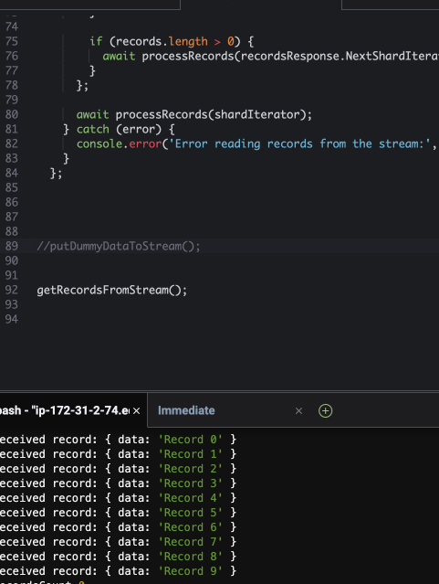

# AWS Kinesis Data Stream Example

This repository contains a Node.js script that demonstrates how to interact with an AWS Kinesis Data Stream. It provides a basic example of how to send dummy data to a Kinesis stream and how to read that data from the stream using the AWS SDK for JavaScript.

## Prerequisites

Before you can use this code, make sure you have the following prerequisites:

1. Create a Kinesis Data Stream in your AWS account. Make a note of the stream name and the region where you created the stream.

## Usage

Follow these steps to use the code in a Cloud9 IDE:

1. Clone the repository to your Cloud9 environment:

   ```bash
   git clone https://github.com/yourusername/your-repo.git
   cd your-repo
   ```

2. Install the required Node.js dependencies:

   ```bash
   npm install
   ```

   it will setup aws-sdk

3. Open the `app.js` file in your Cloud9 IDE and replace the following placeholders:

   - `'your-region'`: Replace with your AWS region.
   - `'my-demo-kinesis-data-stream'`: Replace with the name of your Kinesis Data Stream.
   - `'your-shard-id'`: Replace with the shard ID you want to read from.

4. Save the changes to `app.js`.

5. Run the code using Node.js:

   ```bash
   node app.js
   ```

   This will send dummy data to your Kinesis Data Stream and read it back.

6. Check the Cloud9 console for the output, which should display the records sent and received.

